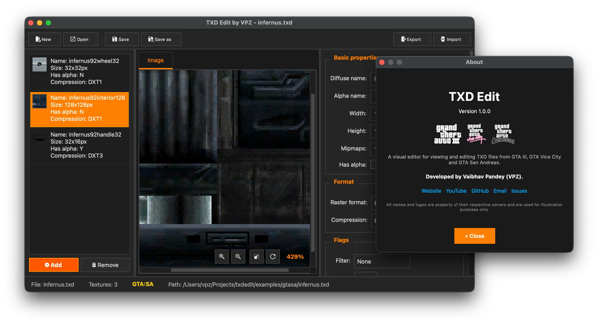

# TXD Edit

<div align="center">

**A modern, cross-platform desktop application for viewing and editing TXD (Texture Dictionary) files from GTA games**

[](LICENSE)
[]()
[](https://github.com/vaibhavpandeyvpz/txdedit/releases)
[](https://github.com/vaibhavpandeyvpz/txdedit/actions)

[Website](https://vaibhavpandey.com/) • [GitHub](https://github.com/vaibhavpandeyvpz/txdedit) • [Issues](https://github.com/vaibhavpandeyvpz/txdedit/issues) • [YouTube](https://www.youtube.com/@vaibhavpandeyvpz)

</div>



---

## ✨ Features

### Core Functionality

- **📂 Open & Save TXD Files**: Full support for reading and writing GTA TXD archives
- **🆕 Create New TXD Files**: Start from scratch with empty texture dictionaries
- **👁️ Texture Preview**: High-quality preview with support for:
  - Diffuse texture view
  - Alpha/mask channel view
  - Combined view (diffuse with alpha applied)
- **📝 Edit Texture Properties**:
  - Texture names (diffuse and alpha)
  - Dimensions (width and height)
  - Mipmap count
  - Compression format (DXT1, DXT3, uncompressed, etc.)
  - Raster format
  - Filter and wrapping flags
  - Alpha channel usage

### Advanced Features

- **➕ Add Textures**: Import images as new textures into TXD files
- **➖ Remove Textures**: Delete textures from archives
- **📤 Export Textures**: Export individual textures (diffuse, alpha, or both) to PNG/JPEG/BMP
- **📥 Import Textures**: Replace existing textures with new images
- **📦 Bulk Export**: Export all textures from a TXD file to a folder
- **🔄 Replace Images**: Replace diffuse or alpha channels of existing textures
- **⌨️ Keyboard Shortcuts**:
  - `Ctrl/Cmd + +/-` for zoom in/out
  - `Ctrl + Mouse Wheel` for zooming
- **🖱️ Interactive Preview**: Pan and zoom with intuitive controls

### User Interface

- **🎨 Dark Theme**: GTA trilogy-inspired dark theme with orange accents
- **📋 Rich Texture List**: Shows thumbnails, dimensions, size, compression, and alpha info
- **🎯 Context Menu**: Right-click on textures for quick actions
- **📊 Status Bar**: Real-time file and texture information
- **🎛️ Professional Layout**: Three-panel interface with resizable sections

## 📥 Download

### Latest Release

Download the latest release for your platform:

- **Windows**: [Download ZIP](https://github.com/vaibhavpandeyvpz/txdedit/releases/latest/download/txdedit-windows-x64.zip)
- **macOS**: [Download DMG](https://github.com/vaibhavpandeyvpz/txdedit/releases/latest/download/txdedit-macos-x64.dmg)
- **Linux**: [Download AppImage](https://github.com/vaibhavpandeyvpz/txdedit/releases/latest/download/txdedit-linux-x86_64.AppImage)

### All Releases

View all releases and download previous versions: [Releases](https://github.com/vaibhavpandeyvpz/txdedit/releases)

### Platform Support

| Platform       | Format    | Status             |
| -------------- | --------- | ------------------ |
| Windows 10/11  | ZIP (x64) | ✅ Fully Supported |
| macOS 10.15+   | DMG (x64) | ✅ Fully Supported |
| Linux (x86_64) | AppImage  | ✅ Fully Supported |

## 🚀 Quick Start

### Requirements

- **CMake** 3.16 or higher
- **C++17** compatible compiler (GCC, Clang, or MSVC)
- **Qt 5** or **Qt 6** (Core and Widgets modules)

### Building

#### Linux & macOS

```bash
git clone --recursive https://github.com/vaibhavpandeyvpz/txdedit.git
cd txdedit
mkdir build && cd build
cmake ..
make
```

**Note**: If you cloned without `--recursive`, initialize submodules:
```bash
git submodule update --init --recursive
```

The executable will be in `build/bin/txdedit`.

#### Windows (Visual Studio)

```bash
git clone --recursive https://github.com/vaibhavpandeyvpz/txdedit.git
cd txdedit
mkdir build && cd build
cmake .. -G "Visual Studio 16 2019"
cmake --build . --config Release
```

**Note**: If you cloned without `--recursive`, initialize submodules:
```bash
git submodule update --init --recursive
```

The executable will be in `build/bin/Release/txdedit.exe`.

#### Installing Qt

- **macOS**: `brew install qt@6` or download from [qt.io](https://www.qt.io/download)
- **Linux**: `sudo apt-get install qt6-base-dev` (Ubuntu/Debian) or use your distribution's package manager
- **Windows**: Download and install from [qt.io](https://www.qt.io/download)

### Pre-built Binaries

If you prefer not to build from source, you can download pre-built binaries from the [Releases](https://github.com/vaibhavpandeyvpz/txdedit/releases) page.

## 📖 Usage

### Basic Workflow

1. **Launch** the application
2. **Open** a TXD file via `File → Open` or `Ctrl/Cmd + O`
3. **Select** a texture from the left panel to view and edit
4. **Modify** properties in the right panel
5. **Save** changes with `File → Save` or `Ctrl/Cmd + S`

### Creating a New TXD

1. Click `File → New` or press `Ctrl/Cmd + N`
2. Add textures using the `Add` button or `Texture → Add texture...`
3. Import images to create new textures
4. Save your new TXD file

### Exporting Textures

- **Single Texture**: Right-click a texture → `Export...` or use `Texture → Export`
- **Bulk Export**: `Texture → Bulk export...` to export all textures at once
- Choose to export diffuse, alpha, or both images

### Keyboard Shortcuts

| Action       | Shortcut               |
| ------------ | ---------------------- |
| New File     | `Ctrl/Cmd + N`         |
| Open File    | `Ctrl/Cmd + O`         |
| Save File    | `Ctrl/Cmd + S`         |
| Save As      | `Ctrl/Cmd + Shift + S` |
| Close File   | `Ctrl/Cmd + W`         |
| Zoom In      | `Ctrl/Cmd + +`         |
| Zoom Out     | `Ctrl/Cmd + -`         |
| Zoom (Mouse) | `Ctrl + Mouse Wheel`   |

## 📋 Supported Formats

### Compression Formats

- ✅ Uncompressed (RGBA8, RGB8, and various bit depths)
- ✅ DXT1 (BC1) - Full support for compression and decompression
- ✅ DXT3 (BC3) - Full support for compression and decompression
- ✅ PAL4/PAL8 - Palette-based textures with automatic palette generation

### Raster Formats

- ✅ R8G8B8A8
- ✅ B8G8R8A8
- ✅ B8G8R8
- ✅ R5G6B5
- ✅ A1R5G5B5
- ✅ R4G4B4A4
- ✅ R5G5B5
- ✅ LUM8
- ✅ Palette formats (PAL4/PAL8 with libimagequant)

### Export Formats

- ✅ PNG
- ✅ JPEG
- ✅ BMP

## 🏗️ Architecture

The application is designed with a clean separation between core logic and GUI:

```
txdedit/
├── core/           # Core TXD library (no GUI dependencies)
│   ├── TXDArchive.h/cpp          # Main archive reading/writing
│   ├── TXDTextureHeader.h/cpp    # Texture metadata
│   ├── TXDConverter.h/cpp        # Format conversion
│   └── TXDTypes.h               # Type definitions
│
├── gui/            # Qt-based GUI application
│   ├── MainWindow.h/cpp         # Main application window
│   ├── TextureListWidget.h/cpp   # Texture list with thumbnails
│   ├── TexturePreviewWidget.h/cpp # Tabbed preview area
│   ├── TextureViewWidget.h/cpp   # Interactive texture view
│   ├── TexturePropertiesWidget.h/cpp # Properties editor
│   ├── AboutDialog.h/cpp         # About screen
│   └── CheckBox.h               # Custom checkbox widget
│
├── icons/          # Application icons
├── logos/          # GTA game logos
└── vendor/         # Third-party libraries
    ├── libsquish/  # DXT compression library
    └── libimagequant/ # Palette generation library
```

### Key Design Principles

- **Separation of Concerns**: Core library is independent of GUI framework
- **Modern C++**: Uses C++17 features, smart pointers, and RAII
- **Cross-platform**: Works on Windows, macOS, and Linux
- **Extensible**: Easy to add new formats and features

## 🛠️ Development

### Project Structure

- **Core Library** (`core/`): Handles all TXD file I/O and format conversion
- **GUI Application** (`gui/`): Qt-based user interface
- **Vendor Libraries** (`vendor/`): Third-party compression libraries

### Building from Source

See the [BUILD.md](BUILD.md) file for detailed build instructions and troubleshooting.

## 🤝 Contributing

Contributions are welcome! Please feel free to submit a Pull Request. For major changes, please open an issue first to discuss what you would like to change.

1. Fork the repository
2. Create your feature branch (`git checkout -b feature/AmazingFeature`)
3. Commit your changes (`git commit -m 'Add some AmazingFeature'`)
4. Push to the branch (`git push origin feature/AmazingFeature`)
5. Open a Pull Request

## 📝 License

This project is licensed under the MIT License. See [LICENSE](LICENSE) for details.

### Third-Party Libraries

This project uses the following open-source libraries:

- **libsquish** (1.10) - DXT compression/decompression
- **libimagequant** (2.x) - Palette generation for PAL4/PAL8 textures
- **Qt** - Cross-platform GUI framework

## 🙏 Acknowledgments

- Built with [Qt](https://www.qt.io/) framework
- Uses [libsquish](https://sourceforge.net/projects/libsquish/) for DXT compression
- Uses [libimagequant](https://github.com/ImageOptim/libimagequant) for palette generation

## 📧 Contact

- **Website**: [vaibhavpandey.com](https://vaibhavpandey.com/)
- **Email**: contact@vaibhavpandey.com
- **GitHub**: [@vaibhavpandeyvpz](https://github.com/vaibhavpandeyvpz)
- **YouTube**: [@vaibhavpandeyvpz](https://www.youtube.com/@vaibhavpandeyvpz)

## ⚠️ Known Limitations

- PS2 TXD format is not supported
- ATC (AMD Texture Compression) formats are not supported
- Some advanced texture conversion features may be simplified

---

<div align="center">

**Made with ❤️ by [VPZ](https://vaibhavpandey.com/)**

[⭐ Star this repo](https://github.com/vaibhavpandeyvpz/txdedit) if you find it useful!

</div>
